# API Endpoint Flows

This document visualizes the control flow for all API endpoints in the BooksTrack system. It is generated based on the codebase as of November 2025.

**Legend:**
- **Router:** Hono Router (`src/router.ts`)
- **Handler:** Logic in `src/handlers/`
- **Service:** Business logic in `src/services/`
- **KV:** Cloudflare KV Storage
- **DO:** Durable Object
- **External API:** Google Books, OpenLibrary, ISBNdb, Gemini

## Table of Contents

1. [Search Endpoints (V1)](#search-endpoints-v1)
2. [Batch Operations](#batch-operations)
3. [WebSocket & Job Management](#websocket--job-management)
4. [Results Retrieval](#results-retrieval)
5. [Metrics & Admin](#metrics--admin)
6. [Critical Issues & Findings](#critical-issues--findings)

---

## Search Endpoints (V1)

### GET /v1/search/isbn

Canonical ISBN search with multi-provider fallback and enrichment.

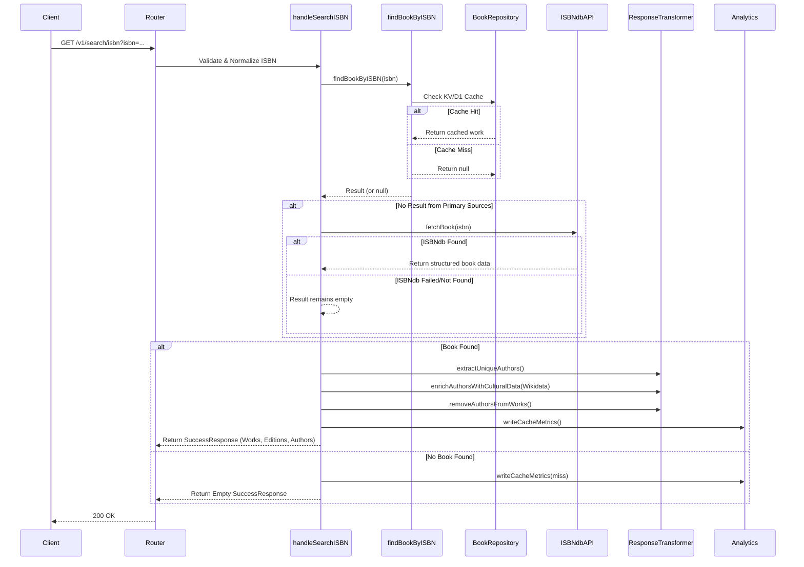

### GET /v1/search/title

Title search optimized for iOS search UI (max 20 results).

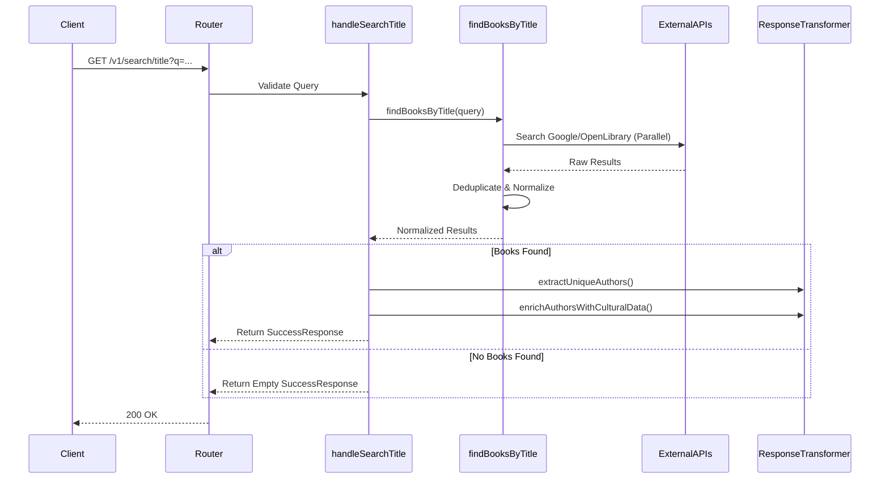

### GET /v1/search/advanced

Advanced search by title and/or author with caching.

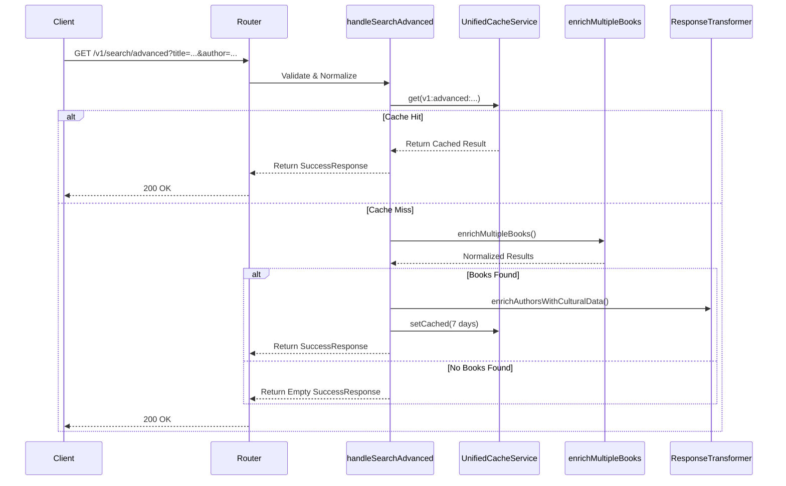

### GET /v1/editions/search

**⚠️ CRITICAL ISSUE:** Argument mismatch in implementation (see Findings).

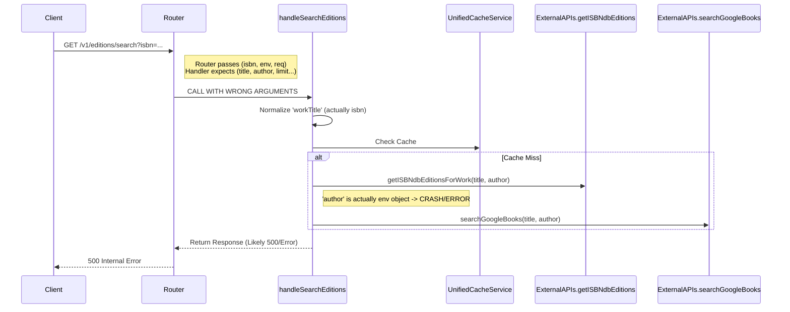

---

## Batch Operations

### POST /v1/enrichment/batch

Asynchronous batch enrichment using Durable Objects for progress tracking.

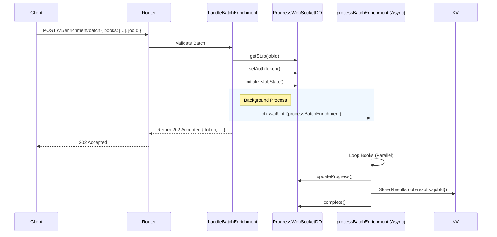

### POST /api/scan-bookshelf/batch

Batch photo scanning with Gemini AI.

**⚠️ CRITICAL ISSUE:** Broken error handling logic (see Findings).

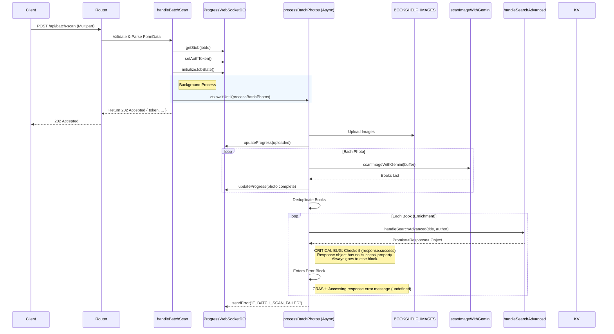

### POST /api/import/csv-gemini

CSV import using Gemini for parsing.

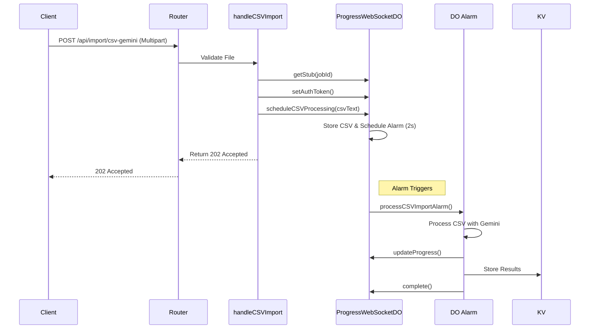

---

## WebSocket & Job Management

### GET /ws/progress

WebSocket upgrade and connection handling.

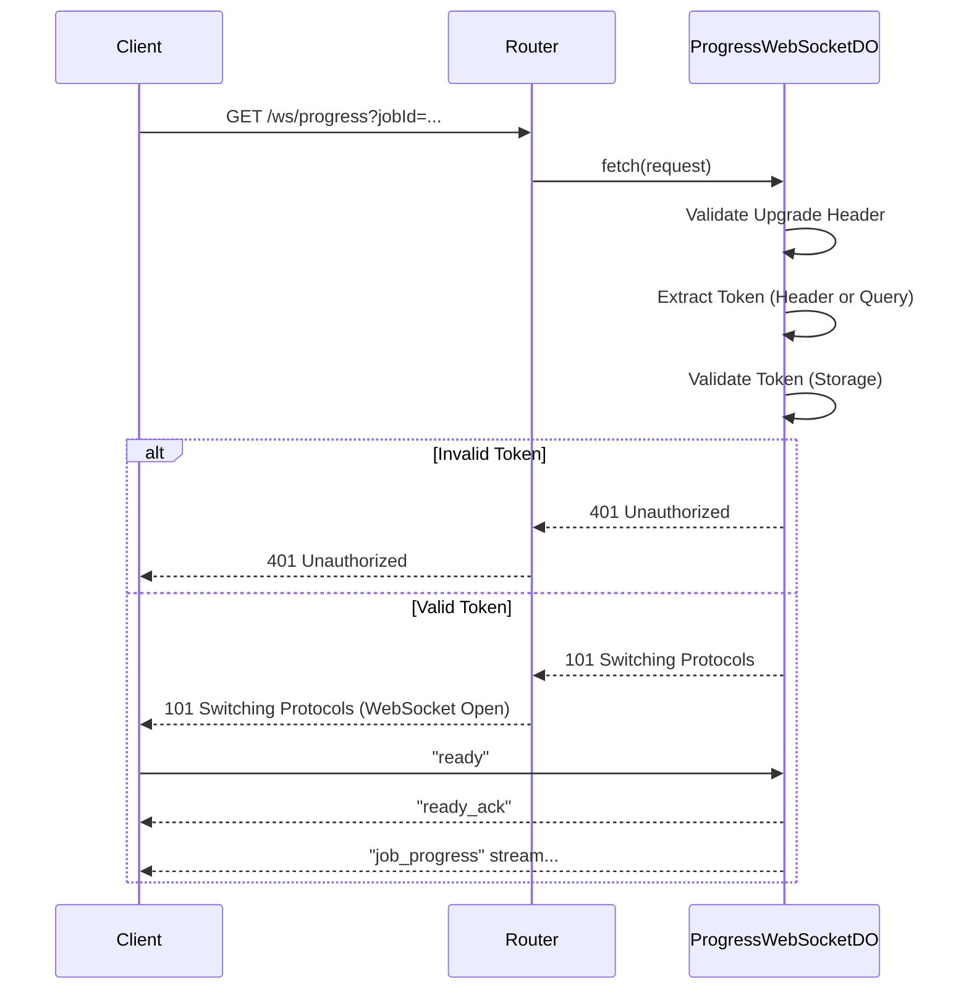

### POST /api/token/refresh

Refresh authentication token for long-running jobs.

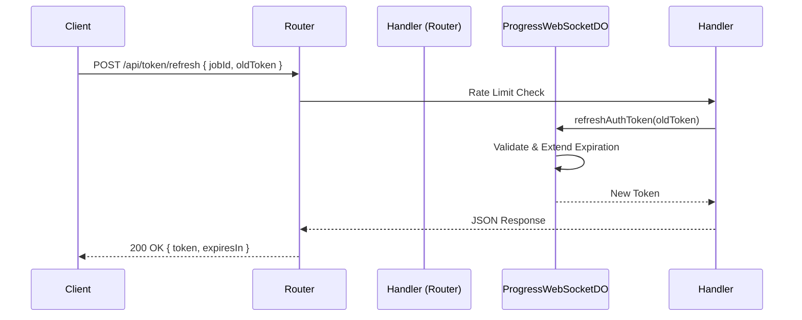

### GET /api/job-state/:jobId

Retrieve current job state (for reconnection).

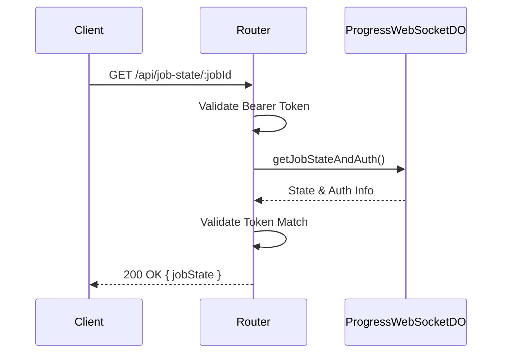

---

## Results Retrieval

### GET /v1/jobs/:jobId/results

Unified results endpoint (fallback for specific result types).

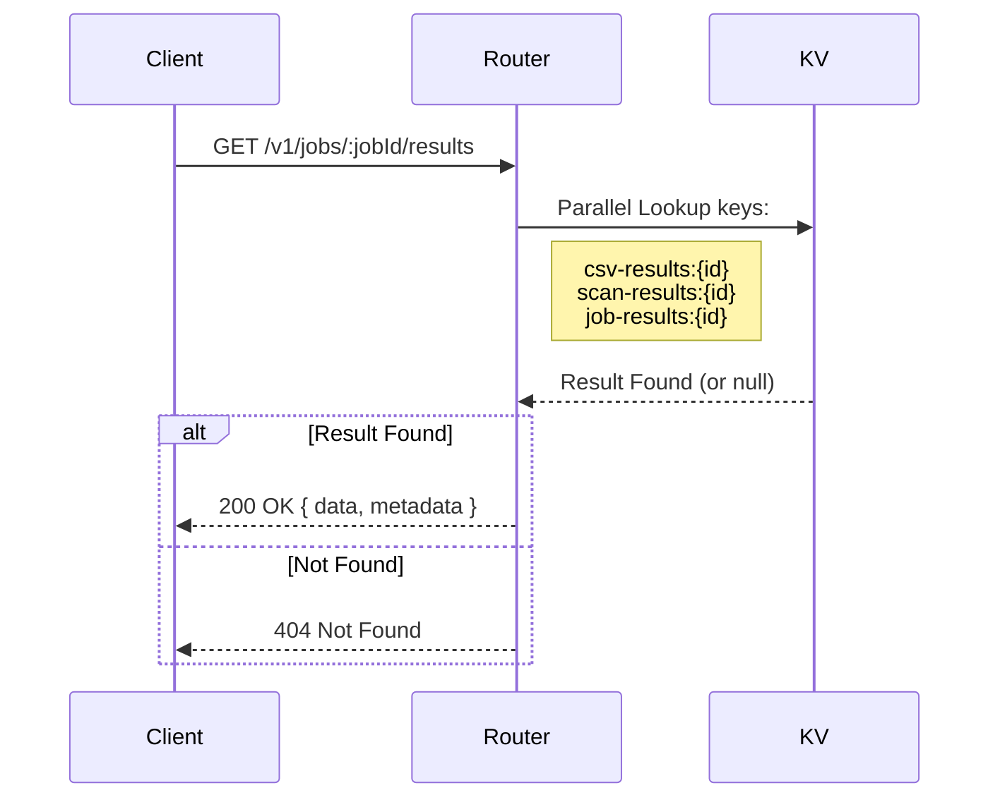

---

## Metrics & Admin

### GET /metrics

Prometheus metrics endpoint.

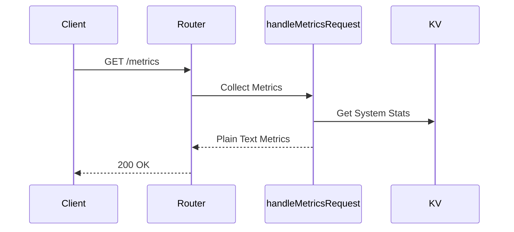

### GET /api/cache/stats

Real-time cache statistics via RPC.

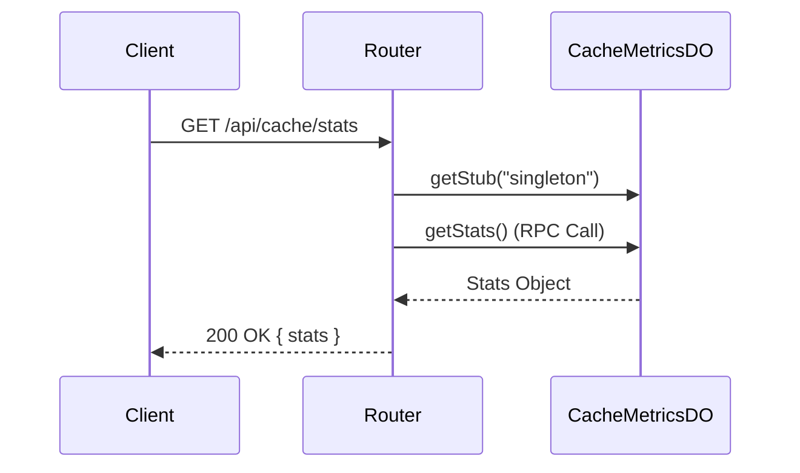

---

## Critical Issues & Findings

During the analysis of the API flows, the following critical issues were identified which require immediate attention.

### 1. `handleSearchEditions` Argument Mismatch
**Severity: ~~Critical~~ RESOLVED - False Positive**
- **Endpoint:** `GET /v1/editions/search`
- **Location:** `src/router.ts` vs `src/handlers/v1/search-editions.ts`
- **Status:** ✅ **VERIFIED CORRECT** (Nov 24, 2025)
- **Resolution:** The router correctly extracts `workTitle`, `author`, and `limit` from query parameters before calling the handler. No mismatch exists.
  ```typescript
  // router.ts:1087-1115
  const workTitle = c.req.query("workTitle") || c.req.query("title") || "";
  const author = c.req.query("author") || "";
  const limit = parseInt(c.req.query("limit") || "20");
  return await handleSearchEditions(workTitle, author, limit, c.env, getCtx(c), c.req.raw);
  ```

### 2. `handleBatchScan` Logic Error
**Severity: ~~Critical~~ RESOLVED**
- **Endpoint:** `POST /api/batch-scan`
- **Location:** `src/handlers/batch-scan-handler.ts:300-307, 486-509`
- **Status:** ✅ **FIXED** (Nov 24, 2025, commit 3b5027c)
- **Original Issue:**
    - The handler called `await handleSearchAdvanced(...)` which returns a `Response` object.
    - The code checked `if (apiResponse.success)` treating it as a parsed JSON object.
    - The `Response` object does not have a `success` property (it has `ok` and `status`).
- **Fix Applied:**
    1. Parse Response before accessing properties: `const apiResponse = await response.json()`
    2. Added missing `ctx` parameter for proper cache operations
    3. Added try-catch error handling around JSON parsing to prevent unhandled crashes
- **Grok-4 Verified:** Fix correctly handles Response → JSON parsing with proper error resilience

### 3. Duplicate ISBN Validation Logic
**Severity: Minor (Code Smell)**
- **Location:** `src/handlers/v1/search-isbn.ts` defines `isValidISBN`, `isValidISBN10Checksum`, etc. locally.
- **Issue:** This logic likely duplicates `src/utils/normalization.js` or other shared validators. It should be centralized.

### 4. Deprecated Endpoints
**Severity: Informational**
- The legacy endpoints (`/search/title`, `/search/isbn`, etc.) are correctly marked with `Deprecation` and `Sunset` headers, pointing to the V1 equivalents.
