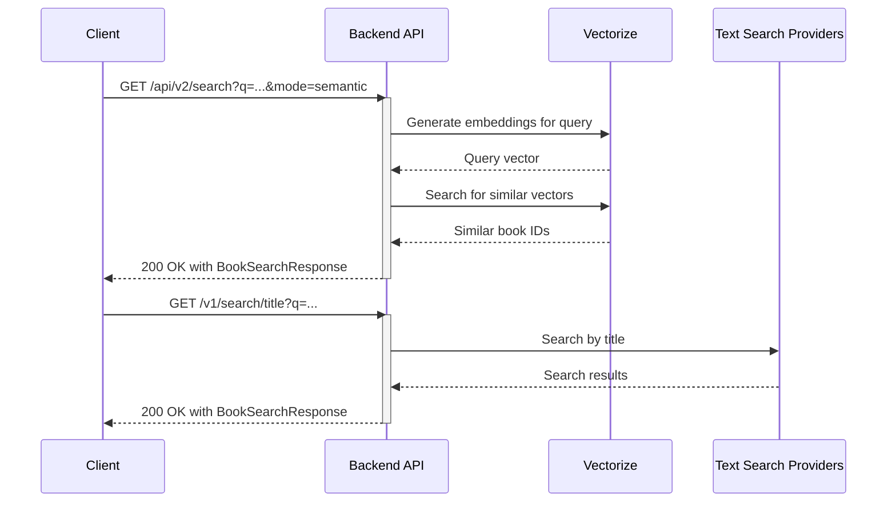
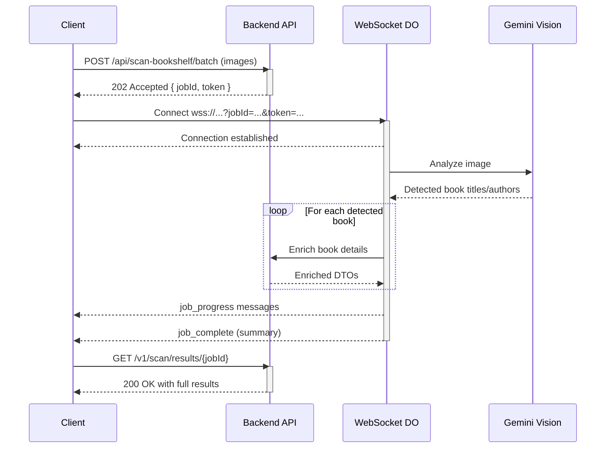
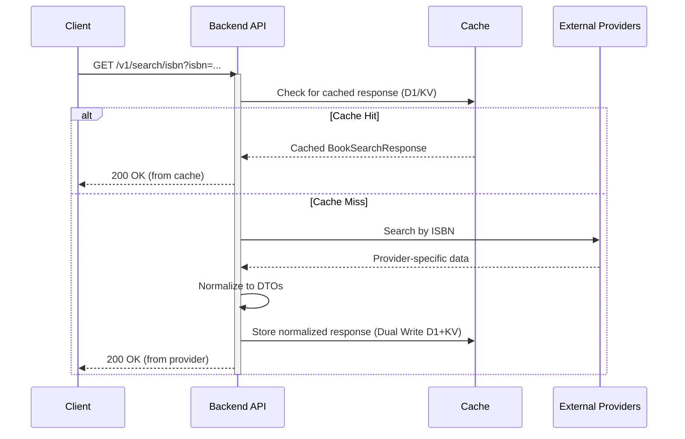

# Product Requirements Document (PRD)

BooksTrack Backend – Ideal State

Status: Active
Owner: Backend Platform
Stakeholders: iOS App, Harvest Dashboard, Operations
Last Updated: 2025-11-28
API Contract Version: v2.7.0
Authoritative Contract: `docs/openapi.yaml`

## 1. Product Overview
- Name: BooksTrack Backend (Cloudflare Workers API)
- Purpose: Provide fast, reliable, and cost-efficient book discovery, enrichment, and AI-powered scanning for the BooksTrack iOS app and associated dashboards.
- Primary Clients:
  - BooksTrack iOS app (Capacitor)
  - Harvest dashboard (web)
- Production URL: https://api.oooefam.net
- Dashboard: https://harvest.oooefam.net

## 2. Goals and Non-Goals
### Goals
- Low-latency, multi-provider book search (Google Books, OpenLibrary, ISBNdb)
- AI-powered bookshelf scanning and CSV parsing using Gemini 2.0 Flash
- Consistent API response envelope, strong type contracts, and progressive deprecation of legacy endpoints
- Real-time job progress via Durable Objects, Cloudflare Workflows, and WebSockets
- Efficient caching strategy across KV, D1, R2; harvest and caching workflows that respect third-party quotas
- Robust observability (analytics, traces, logs); measurable SLOs
- Feature-flagged rollouts for zero-downtime deployment and easy rollback

### Non-Goals
- Full-blown user auth/identity system (token handling for WS only)
- Proprietary enterprise search ranking or ML-driven recommendation engine
- Data warehousing/BI beyond Workers Analytics Engine datasets
- Multi-tenant isolation beyond today’s rate-limiting and quotas

## 3. Personas and Use Cases
- Consumer (Primary): iOS user scanning a shelf, importing CSV, or searching by title/author/ISBN. Needs fast feedback and progress visibility.
- Librarian/Power User: Wants batch enrichment and reliable cover harvesting with quota-aware execution.
- Maintainer/Operator: Needs health signals, cost controls, safe rollouts, and easy debugging.

## 4. Success Metrics
### Functional
- Search hit rate (combined providers): ≥ 95% for mainstream titles
- AI scan precision/recall (measured via test corpus): ≥ 90%/85%
- CSV import auto-parse success without manual config: ≥ 95%

### Performance (p95/p99)
- Cache hits: p95 < 200 ms / p99 < 350 ms
- Cold path external calls: p95 < 1000 ms / p99 < 1800 ms
- WebSocket progress delivery: ≤ 250 ms lag from stage change

### Reliability
- Error budget: ≤ 0.1% failed requests/month
- WS reconnection recovery: 99% of jobs recover state on reconnect

### Cost
- Keep AI usage within budget via rate-limit and job batching (alerts ≥ 80% quota)
- ISBNdb daily limit compliance (≤ 5000/day) with backoff/caching

## 5. Scope – Feature Requirements
### 5.1 Multi-Provider Search & Discovery
- **Text Search (v1):**
  - Inputs: title, author, isbn; optional maxResults
  - Providers: Google Books (primary), OpenLibrary (fallback), ISBNdb (for detail and covers)
- **Semantic Search (v2):**
  - Inputs: Natural language query (`q`), `mode=semantic`
  - Provider: Cloudflare Vectorize with BGE-M3 embeddings
- **Common Features:**
  - Normalization: Canonical WorkDTO, EditionDTO, AuthorDTO
  - Edge Caching: Hot KV (2h), Cold R2 (14d), cache keys deterministic and documented
  - Response: Unified envelope `{ data, metadata{timestamp, provider, cached}, error? }`



### 5.2 AI Bookshelf Scan
- Input: Image up to 10MB (MAX_SCAN_FILE_SIZE) or Batch (1-5 photos)
- Model: Gemini 2.0 Flash; defensive fallback to `"unknown"` model label when metadata missing
- Pipeline: quality check → AI detection → parallel enrichment (≤ CONCURRENCY_LIMIT) → categorization → results
- Progress: WebSocket DO with stages and deltas; reconnection sync via job state endpoint
- Output: Detected books, enrichment, confidence scores, modelUsed, suggestions



### 5.3 CSV Import
- **WebSocket Flow (v1 - Legacy):**
  - Input: CSV (max size consistent with MAX_SCAN_FILE_SIZE)
  - Endpoint: `/api/import/csv-gemini`
  - AI-assisted parsing (Gemini CSV) with schema inference
  - Progress: WebSocket DO with stages and deltas
- **Cloudflare Workflows Pipeline (v2 - Recommended):**
  - Input: CSV via multipart/form-data
  - Endpoint: `/api/v2/imports`
  - Engine: **Cloudflare Workflows** (`BookImportWorkflow`) for robust, stateful execution with retries.
  - Progress: Polling `/api/v2/imports/{jobId}` or SSE stream `/api/v2/imports/{jobId}/stream`.
- **Common Features:**
  - Output: Parsed entries, normalization to canonical DTOs, rejected rows with reasons

```mermaid
graph TD
    subgraph V1 WebSocket Flow
        A[Client POST /api/import/csv-gemini] --> B{Backend};
        B --> C[WebSocket DO];
        C --> D[Gemini AI for parsing];
        D --> C;
        C -- job_progress --> A;
        C -- job_complete --> A;
        A --> E[Client GET /v1/csv/results/{jobId}];
    end
    subgraph V2 Workflows Flow
        F[Client POST /api/v2/imports] --> G{Backend};
        G --> W[Cloudflare Workflow];
        W --> H[JobStateManager DO];
        H -- progress --> I[SSE / Polling];
        I --> F;
        W -- Writes to KV/D1 --> J[Store];
        F --> K[Client GET /api/v2/imports/{jobId}/results];
        K -- Reads from Store --> J;
    end
```

### 5.4 Batch Enrichment
- Input: list of ISBN/title/author tuples with bounded batch size
- Strategy: Provider calls with rate limiting; cache-first; coalescing to reduce duplicate work
- Progress: WebSocket with processedCount/total; resumable on reconnect
- Output: `EnrichmentResult { works, editions, authors }` with provenance fields

### 5.5 Author-Driven Cover Harvest (New)
- **Goal**: Maximize cover availability for popular authors while respecting quotas.
- **Strategy**:
  - **Author Discovery**: Identifies trending authors via analytics and curated lists.
  - **Cache Depth Analysis**: Checks existing coverage; skips authors with >50% coverage to prevent waste.
  - **Bibliography Expansion**: Expands author to ISBN list via OpenLibrary.
  - **Execution**: Daily cron job (`0 3 * * *`) orchestrates harvest.
  - **Queues**: `author-warming-queue` handles async processing.
- **Quota**: Respects ISBNdb daily limit (5000/day) with smart allocation.
- **Storage**: Cold storage in R2 with canonical path scheme; Metadata in KV/D1.

### 5.6 Real-time Progress
- Durable Objects for WS auth, token refresh, hibernation-based cost reduction
- Backwards-compatible token mechanisms; strongly prefer WS subprotocol for auth
- Job state manager DO to support reconnection and cross-request continuity

### 5.7 Documentation & Discovery
- **Capabilities**: `GET /api/v2/capabilities` exposes feature flags, limits, and active providers.
- **Swagger UI**: `GET /doc` provides interactive API documentation.
- **OpenAPI Spec**: `GET /doc/openapi.json` returns the generated spec for client generation.

## 6. API Requirements
### 6.1 Envelope (v2.0)
- Success: `{ data: <payload>, metadata: { timestamp, provider?, cached? } }`
- Error: `{ data: null, metadata: { timestamp }, error: { message, code, details? } }`
- Response headers: `Content-Type: application/json`; `X-Response-Format: v2.0`; `X-Error-Type` on errors

### 6.2 Versioning and Deprecation
- Current: v1 routes under `/v1/search/*`, v2 routes under `/api/v2/*`
- Deprecated Legacy: `/search/*`; Deprecation and Sunset headers set; removal no earlier than March 1, 2026
- Never break userspace: provide alternates and migration time; feature flags for safe rollouts

### 6.3 Endpoints (representative)
#### 6.3.1 V1 API (Legacy & Compatibility)
- `GET /v1/search/isbn?isbn=…` → 200 | 400 | 404
- `GET /v1/search/title?q=…`
- `GET /v1/search/advanced?title=…&author=…`
- `POST /api/scan-bookshelf/batch` (Batch Image Scan)
- `POST /api/import/csv-gemini` (Legacy CSV)
- `POST /api/token/refresh` `{ jobId, oldToken }`
- `GET /v1/jobs/{jobId}/status` (Unified Job Status)
- `GET /metrics` → 200 (analytics)
- `GET /health` → 200 (Service Health)

#### 6.3.2 V2 API (Modern & Intelligent)
- `GET /api/v2/search?q=…&mode=semantic`
- `GET /api/v2/recommendations/weekly`
- `POST /api/v2/imports` (Start Import Workflow)
- `GET /api/v2/imports/{jobId}` (Import Status)
- `GET /api/v2/imports/{jobId}/stream` (SSE Progress)
- `POST /api/v2/books/enrich/detailed` (Comprehensive Metadata)
- `GET /api/v2/capabilities` (Feature Discovery)
- `GET /doc` (Swagger UI)



### 6.4 Rate Limiting and Quotas
- Per-IP DO-based rate limiter (e.g., 10 req/60s)
- Backoff policies for providers; circuit breaker after consecutive failures
- ISBNdb daily limit enforcement; fallback to cached covers

### 6.5 CORS
- Allow native apps without Origin; allow pre-configured web origins
- Expose analytics headers; maintain OPTIONS handling

## 7. Architecture
- **Runtime**:
  - **Cloudflare Workers**: Hono router for high-performance API handling.
  - **Cloudflare Workflows**: Long-running asynchronous jobs (CSV Import).
- **State**:
  - **Durable Objects**: WS connections, Job State Manager, Rate Limiter, Cache Metrics.
- **Storage**:
  - **D1 Database**: Primary relational store (Books, Authors, Relations).
  - **KV**: Hot cache (Books, scan results) and configuration.
  - **R2**: Cold storage (Images, backup).
  - **Vectorize**: Semantic search index (`book-embeddings`).
- **Queues**:
  - `author-warming-queue`: Async author cache warming.
  - `enrichment-queue`: Bulk enrichment processing.
- **AI & Search**:
  - Gemini 2.0 Flash for vision and parsing.
  - Cloudflare Workers AI for embedding generation.
  - Cloudflare Vectorize for semantic search.
- **Caching**:
  - **Dual-Write Strategy**: Writes persist to D1 (primary) and KV (cache).
  - **Smart Routing**: Reads prioritize D1 or KV based on `D1_READ_PERCENTAGE`.
  - Hot KV TTL 2h, Cold R2 TTL 14d.

## 8. Performance and Scalability
### Targets
- See Section 4; align with Workers CPU limits and network I/O constraints

### Concurrency
- Enrichment parallelism up to `CONCURRENCY_LIMIT` (default 10); configurable via env

### Coalescing
- Request coalescing for in-flight enrichments to avoid thundering herd

### Dual-Write Performance
- D1 writes are primary for durability; KV writes follow for read performance.
- Read path can shift traffic between D1 and KV via feature flags to manage load.

## 9. Security, Privacy, Compliance
- WS Auth
  - Prefer `Sec-WebSocket-Protocol` for tokens; deprecate URL tokens; rotate via `/api/token/refresh`
- Secrets
  - Managed via wrangler secrets and secrets store bindings; never logged
- Data Handling
  - No user PII stored; images retained only if explicitly configured; cover images cached under fair use and provider terms
- Transport
  - Enforce HTTPS; no mixed content
- Abuse and DoS
  - Rate limiter DO; max input sizes; strict validation for ISBN and query lengths

## 10. Observability and Operations
- Logging and Tracing
  - Workers Logs and Traces enabled; 100% sampling in non-prod, 20–50% in prod as needed
  - Structured logs; correlation IDs per request/job
- Metrics (Workers Analytics Engine)
  - PERFORMANCE_ANALYTICS: latency, p95/p99, cache hit ratio
  - CACHE_ANALYTICS: TTL usage, warm vs cold, invalidations
  - PROVIDER/AI_ANALYTICS: provider latency, error rates, costs (approx)
  - SAMPLING_ANALYTICS: request sampling/AB data
  - **Dual-Write Metrics**: Track D1 vs KV write latency and consistency.
- Alerts
  - Error rate > 0.5% over 5 min
  - p99 latency > target for 10 min
  - Cache hit ratio falls below 60%
  - AI/ISBNdb quota ≥ 80% usage
- Runbooks
  - Router rollback: set `ENABLE_HONO_ROUTER=false`
  - WS failures: validate DO migrations, hibernation flag, token subprotocol usage
  - Provider outage: enable aggressive caching, reduce concurrency, update backoff

## 11. Testing and Quality
- Framework: Vitest; Node environment
- Targets
  - Overall coverage ≥ 75%
  - Validators/Normalizers/Auth 100%
  - Cache ≥ 90%, External APIs ≥ 85%, Enrichment ≥ 85%, WS DO ≥ 80%, Handlers ≥ 75%, Services ≥ 70%
- Types/Contracts
  - Canonical DTOs are the source of truth; unit tests verify normalization for each provider
- E2E
  - v1 search flows, AI scan happy-path and oversized image, CSV import edge cases
  - WS lifecycle tests: open/refresh/reconnect, hibernation path
  - Rate-limiter behavior under concurrent clients
- CI
  - Lint/typecheck/test/coverage gates; no deploy on failing tests; coverage threshold enforced

## 12. Release Plan and Lifecycle
- Environments
  - Dev (workers_dev), Staging, Prod (custom domain routes)
- Feature Flags
  - `ENABLE_HONO_ROUTER` default true; manual router as immediate rollback
  - `ENABLE_HIBERNATION_WEBSOCKET` for DO hibernation rollout
  - `ENABLE_REFACTORED_DOS` for progressive DO architecture refactor
  - `ENABLE_D1_WRITES` for dual-write storage migration
- Phased Rollout
  - 1% → 10% → 50% → 100% traffic shaping via feature flags and canary metrics
- Deprecation Timeline
  - Legacy `/search/*` sunset March 1, 2026 (headers already set)
- Deployment
  - `wrangler deploy`; instant rollback via config/env flips

## 13. Risks and Mitigations
- Provider Limits/Outages
  - Mitigation: cache-first, multi-provider fallback, exponential backoff, circuit breaker
- AI Cost/Rate Spikes
  - Mitigation: concurrency caps, budget alerts, batch modes
- WS Scaling
  - Mitigation: hibernation DOs, shard by jobId, strict token TTLs and refresh flows
- Cache Inconsistency (D1 vs KV)
  - Mitigation: `VALIDATE_DUAL_WRITES` in dev, D1 as source of truth, KV as cache only.
- Breaking Changes
  - Mitigation: never break userspace; feature flags; compatibility layers; long deprecation windows

## 14. Open Questions
- Do we need additional provider(s) (e.g., LibraryThing) for niche coverage?
- Should we store user-submitted images beyond processing for audit/debug? If yes, retention period and PII policy?
- Budget guardrails for AI usage per month? Hard caps?
- Internationalization: language-aware search normalization priority?

## 15. Acceptance Criteria
- All v1 endpoints return unified envelope with `X-Response-Format: v2.0`
- Hono router enabled by default; manual router behind feature flag for rollback
- AI scan and CSV import accept up to 10MB inputs; reject with clear error envelope otherwise
- WebSocket progress:
  - Token via subprotocol supported; refresh endpoint works
  - Hibernation mode passes smoke tests; reconnection restores state
- Caching:
  - Hot KV TTL 2h, Cold R2 TTL 14d; measurable cache hit ratio ≥ 60% week over week
- Observability:
  - Metrics, logs, traces visible; alerts wired for error spikes and p99 latency
- Testing:
  - ≥ 75% coverage overall; category thresholds met; E2E suite passes
- Backward Compatibility:
  - Legacy `/search/*` returns Deprecation/Sunset headers; functionality intact until removal date

## 16. Milestones
- M1 (Week 1–2): Hono default, unified envelope everywhere, CI coverage gates in place, search v1 hardened
- M2 (Week 3–4): AI scan/CSV stability, hibernation DO rollout to 50%, cache hit ratio optimization
- M3 (Week 5–6): Author-Driven Harvest system; alerts/dashboards; provider fallback corner cases
- M4 (Week 7–8): Performance tuning to hit p95/p99 SLOs; finalize deprecation playbook; docs and runbooks complete

---

### Appendix A: Environment Variables and Defaults
- `ENABLE_HONO_ROUTER`: true
- `CACHE_HOT_TTL`: 7200 sec
- `CACHE_COLD_TTL`: 1209600 sec
- `MAX_RESULTS_DEFAULT`: 40
- `RATE_LIMIT_MS`: 50
- `CONCURRENCY_LIMIT`: 10
- `MAX_SCAN_FILE_SIZE`: 10485760 bytes (10MB)
- `CONFIDENCE_THRESHOLD`: 0.7
- `OPENLIBRARY_BASE_URL`: https://openlibrary.org
- `ENABLE_D1_WRITES`: true
- `D1_READ_PERCENTAGE`: 100
- `WORKFLOW_ROLLOUT_PERCENT`: 100

### Appendix B: Provider Policies
- Google Books: API key required; log user-agent; monitor quotas and errors
- OpenLibrary: Rate limits apply; be a good citizen; cache results
- ISBNdb: 5000/day limit; throttle and schedule harvesting; prefer cached cover paths
