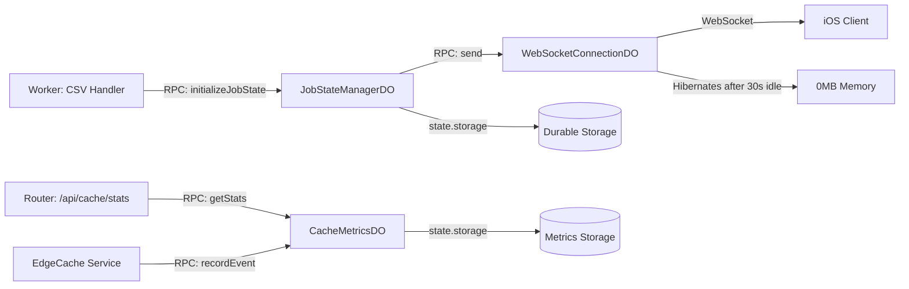

# Sprint 1 Implementation Plan: RPC Standardization & Hibernation Fix

**Duration:** 2 weeks
**Focus:** Durable Objects stability & cost optimization
**Team Structure:** Recommended 2-3 developers (Backend, DevOps/Testing)
**Created:** November 21, 2025
**Status:** Ready for Implementation

---

## 📋 **Pre-Sprint Setup (1 day)**

### Task 0.1: Environment & Tooling Verification
**Owner:** DevOps Lead
**Duration:** 2 hours

**Acceptance Criteria:**
- [ ] `npx wrangler dev` runs successfully with local KV/R2/DO simulation
- [ ] `npx wrangler tail` streams production logs without errors
- [ ] `npx wrangler deployments list` shows recent deployments
- [ ] Team has access to Cloudflare dashboard (Durable Objects metrics)

**Files to verify:**
- `wrangler.toml` - Ensure all bindings are correct
- `.dev.vars` (if exists) - Local secrets configured
- `package.json` - Wrangler version ≥ 4.37.0

**Commands:**
```bash
# Verify local dev environment
npx wrangler dev --test-scheduled

# Verify production access
npx wrangler tail --format=pretty

# Check DO metrics baseline (before changes)
# Access via Cloudflare Dashboard → Workers & Pages → api-worker → Metrics
```

---

## 🎯 **Item 1.1: Fix Durable Object Hibernation (CRITICAL)**

**Context:**
Currently `ENABLE_HIBERNATION_WEBSOCKET = "false"` in `wrangler.toml:104` due to storage errors when DO code changes while instances are hibernated. This prevents 70-80% cost savings.

**Root Cause:**
The hibernation DO (`ProgressWebSocketDO_Hibernation`) accesses `state.storage` in the constructor, which violates Cloudflare's hibernation API requirements.

**Files Affected:**
- `src/durable-objects/progress-socket-hibernation.js` (primary)
- `wrangler.toml` (feature flag toggle)

---

### Task 1.1.1: Refactor Storage Access Pattern
**Owner:** Backend Developer 1
**Duration:** 3 days
**Priority:** P0 (Blocks hibernation enable)

**Problem Analysis:**
Current code in `src/durable-objects/progress-socket-hibernation.js`:
```javascript
// ❌ WRONG: Constructor accesses storage (causes "code has been updated" error)
constructor(state, env) {
  super(state, env);
  this.state = state;
  this.storage = state.storage;  // 🚫 Storage access in constructor
  this.env = env;
}
```

**Required Changes:**

**File:** `src/durable-objects/progress-socket-hibernation.js`

**Step 1.1.1a: Remove constructor storage assignment**
```javascript
// ✅ CORRECT: Only store references, no storage access
constructor(state, env) {
  super(state, env);
  this.state = state;  // Keep for state.getWebSockets()
  this.env = env;
  // ❌ REMOVE: this.storage = state.storage
}
```

**Step 1.1.1b: Update all methods to use `this.state.storage` instead of `this.storage`**

Search-and-replace pattern:
```bash
# Find all instances
grep -n "this.storage\." src/durable-objects/progress-socket-hibernation.js

# Expected ~25 occurrences across these methods:
# - webSocketMessage() (lines 70-112)
# - webSocketClose() (lines 122-142)
# - webSocketError() (lines 150-166) ✅ Already correct
# - handleWebSocketUpgrade() (lines 190-368)
# - setAuthToken() (lines 437-456)
# - initializeJobState() (lines 468-498)
# - updateProgress() (lines 510-571)
# - complete() (lines 583-630)
# - sendError() (lines 642-693)
# - waitForReady() (lines 704-735)
# - scheduleCSVProcessing() (lines 747-765)
# - scheduleBookshelfScan() (lines 778-796)
# - All alarm() method paths (lines 807-1012)
```

**Example refactor (lines 73-76):**
```javascript
// BEFORE
async webSocketMessage(ws, message) {
  const jobId = await this.storage.get(STORAGE_KEYS.JOB_ID);
  const authToken = await this.storage.get(STORAGE_KEYS.AUTH_TOKEN);

// AFTER
async webSocketMessage(ws, message) {
  const jobId = await this.state.storage.get(STORAGE_KEYS.JOB_ID);
  const authToken = await this.state.storage.get(STORAGE_KEYS.AUTH_TOKEN);
```

**Testing Checklist:**
- [ ] All 25+ occurrences of `this.storage.` replaced with `this.state.storage.`
- [ ] No new TypeScript/ESLint errors introduced
- [ ] `npm test` passes (all WebSocket tests)
- [ ] Manual test: WebSocket connects → send `ready` → receives `ready_ack`

**Validation Command:**
```bash
# Ensure no direct this.storage references remain (except in comments)
grep -n "this\.storage\." src/durable-objects/progress-socket-hibernation.js | grep -v "//"
# Expected: 0 matches
```

---

### Task 1.1.2: Implement Proper `webSocketError` Handler
**Owner:** Backend Developer 1
**Duration:** 1 day
**Dependencies:** Task 1.1.1 complete

**Current State (lines 150-166):**
```javascript
// ✅ Already mostly correct, but needs validation
async webSocketError(ws, error) {
  const jobId = await this.state.storage.get(STORAGE_KEYS.JOB_ID);

  console.error(`[Hibernation DO] WebSocket error for job ${jobId}:`, error);

  await this.state.storage.put("lastError", {
    message: error.message,
    timestamp: Date.now(),
  });

  ws.close(WebSocketCloseCodes.PROTOCOL_ERROR, "Connection error");
}
```

**Required Improvements:**

**Step 1.1.2a: Add error categorization and connection cleanup**
```javascript
async webSocketError(ws, error) {
  const jobId = await this.state.storage.get(STORAGE_KEYS.JOB_ID);

  // Categorize error type
  const errorType = this.categorizeWebSocketError(error);

  console.error(
    `[Hibernation DO ${jobId}] WebSocket error (${errorType}):`,
    error.message,
    { stack: error.stack }
  );

  // Store error with metadata
  await this.state.storage.put("lastError", {
    type: errorType,
    message: error.message,
    stack: error.stack,
    timestamp: Date.now(),
  });

  // Decrement connection count (connection is about to close)
  await this.state.storage.transaction(async (txn) => {
    const count = (await txn.get(STORAGE_KEYS.CONNECTION_COUNT)) || 0;
    await txn.put(STORAGE_KEYS.CONNECTION_COUNT, Math.max(0, count - 1));
  });

  // Choose appropriate close code based on error type
  const closeCode = errorType === 'CLIENT_ERROR'
    ? WebSocketCloseCodes.POLICY_VIOLATION
    : WebSocketCloseCodes.INTERNAL_ERROR;

  ws.close(closeCode, `Connection error: ${errorType}`);
}

// Helper method
categorizeWebSocketError(error) {
  if (error.message.includes('buffer')) return 'BUFFER_OVERFLOW';
  if (error.message.includes('timeout')) return 'TIMEOUT';
  if (error.message.includes('auth')) return 'AUTH_FAILURE';
  return 'UNKNOWN';
}
```

**Testing:**
- [ ] Simulate buffer overflow: Send 10MB+ message
- [ ] Simulate auth failure: Connect with expired token
- [ ] Verify connection count decrements on error
- [ ] Verify error logged to DO storage

---

### Task 1.1.3: Enable Hibernation & Verify Memory Reduction
**Owner:** DevOps Lead
**Duration:** 2 days
**Dependencies:** Tasks 1.1.1 and 1.1.2 complete

**Step 1.1.3a: Deploy to production with feature flag OFF**
```bash
# Deploy refactored code WITHOUT enabling hibernation
# wrangler.toml ENABLE_HIBERNATION_WEBSOCKET = "false"
npx wrangler deploy --message "Refactor: Hibernation DO storage access fix (flag OFF)"

# Wait 2 hours for existing hibernated instances to expire
# Monitor for "code has been updated" errors
npx wrangler tail --format=pretty | grep "code has been updated"
# Expected: 0 occurrences after 2 hours
```

**Step 1.1.3b: Gradual rollout (canary deployment)**

**Phase 1: 1% traffic (Day 1)**

Add to `wrangler.toml`:
```toml
# WebSocket Hibernation API Migration
ENABLE_HIBERNATION_WEBSOCKET = "true"
HIBERNATION_ROLLOUT_PERCENTAGE = "1"  # New variable for gradual rollout
```

Add to `src/utils/durable-object-helpers.ts`:
```typescript
/**
 * Determine if job should use hibernation DO based on rollout percentage
 * Uses deterministic hash to ensure same jobId always gets same result
 */
export function shouldUseHibernation(jobId: string, env: any): boolean {
  if (env.ENABLE_HIBERNATION_WEBSOCKET !== 'true') return false;

  const rolloutPct = parseInt(env.HIBERNATION_ROLLOUT_PERCENTAGE || '0');
  const hash = hashString(jobId);
  return (hash % 100) < rolloutPct;
}

function hashString(str: string): number {
  let hash = 0;
  for (let i = 0; i < str.length; i++) {
    const char = str.charCodeAt(i);
    hash = ((hash << 5) - hash) + char;
    hash = hash & hash; // Convert to 32-bit integer
  }
  return Math.abs(hash);
}
```

**Monitor metrics (1% for 24 hours):**
```bash
# Check DO memory usage via Cloudflare Dashboard
# Dashboard → Workers & Pages → api-worker → Metrics → Durable Objects

# Expected metrics:
# - Active memory: <10MB (90% reduction from 50-80MB baseline)
# - Billing operations: -70% (hibernation reduces state.storage reads)
# - WebSocket latency: <50ms P95 (unchanged)
# - Error rate: <0.1% (same as baseline)
```

**Phase 2-4: Progressive rollout**
- **Day 2:** 10% → Monitor for 24 hours
- **Day 3:** 50% → Monitor for 24 hours
- **Day 4:** 100% → Full rollout

**Success Criteria:**
- [ ] Memory usage per DO: <10MB when idle (baseline: 50-80MB)
- [ ] No "code has been updated" errors in logs
- [ ] WebSocket connection success rate: >99.9%
- [ ] P95 latency: <50ms (no regression)
- [ ] Cost reduction: 70-80% on DO billing operations

**Rollback Procedure (if errors detected):**
```bash
# Immediate rollback - Option 1: Toggle feature flag
# Edit wrangler.toml: ENABLE_HIBERNATION_WEBSOCKET = "false"
npx wrangler deploy --message "ROLLBACK: Disable hibernation (errors detected)"

# Option 2: Use previous deployment
npx wrangler rollback --message "Rollback to pre-hibernation version"
```

---

## 🔄 **Item 1.2: Convert DO Communication to RPC**

**Context:**
Currently, some Durable Object communication uses HTTP fetch with Request object construction:
```javascript
// ❌ CURRENT: HTTP overhead (~10-15ms latency)
const doStub = env.CACHE_METRICS_DO.get(id);
await doStub.fetch(new Request('http://do/stats', { method: 'GET' }));
```

**Goal:** Native RPC calls (direct method invocation):
```javascript
// ✅ TARGET: Native RPC (~1-2ms latency)
const doStub = env.CACHE_METRICS_DO.get(id);
await doStub.getStats();
```

**Good News:** Most DOs already use RPC! Only `CacheMetricsDO` needs migration.

---

### Task 1.2.1: Audit All DO-to-DO Communication
**Owner:** Backend Developer 2
**Duration:** 1 day
**Priority:** P1

**Deliverable:** Comprehensive inventory of all internal DO fetch calls

**Audit Script:**
```bash
# Find all DO fetch calls that use Request construction
grep -rn "new Request" src/ | grep -E "(JobStateManagerDO|RateLimiterDO|CacheMetricsDO)"

# Find all doStub.fetch patterns
grep -rn "doStub\.fetch\|stub\.fetch" src/

# Generate report
cat > docs/sprints/sprint1-rpc-audit.md << 'EOF'
# Sprint 1 RPC Audit Results

## Current DO Communication Patterns

### Already Using RPC (✅ No Changes Needed)
- `JobStateManagerDO` - All methods return plain objects
- `ProgressReporter` - Calls `stateStub.updateProgress()` directly
- `WebSocketConnectionDO` - RPC-ready

### Needs Migration (🔧 Requires Changes)
- `CacheMetricsDO` - Currently uses fetch() for stats and events
  - `src/router.ts:708-710` - Stats endpoint
  - `src/services/edge-cache.js:13-15` - Event recording
  - `src/services/unified-cache.js:197-199` - Event recording

## Files to Modify
1. `src/durable-objects/cache-metrics.js` - Add RPC methods
2. `src/router.ts` - Update stats endpoint
3. `src/services/edge-cache.js` - Update event recording
4. `src/services/unified-cache.js` - Update event recording
EOF
```

**Expected Inventory:**

| File | Line | Current Pattern | Target RPC Method |
|------|------|----------------|-------------------|
| `src/router.ts` | 708-710 | `stub.fetch("http://do/stats")` | `stub.getStats()` |
| `src/services/edge-cache.js` | 13-15 | `stub.fetch("http://do/event")` | `stub.recordEvent()` |
| `src/services/unified-cache.js` | 197-199 | `stub.fetch("http://do/event")` | `stub.recordEvent()` |

**Testing:**
- [ ] All fetch calls identified and documented
- [ ] Categorized by DO type
- [ ] Dependency graph created (which DOs call which)

---

### Task 1.2.2: Add RPC Methods to `CacheMetricsDO`
**Owner:** Backend Developer 2
**Duration:** 1 day
**Dependencies:** Task 1.2.1 complete

**File:** `src/durable-objects/cache-metrics.js`

**Current Architecture:**
```javascript
// ❌ PROBLEM: fetch() handler parses HTTP requests
export class CacheMetricsDO extends DurableObject {
  async fetch(request) {
    const url = new URL(request.url);

    if (url.pathname === '/stats') {
      return this.handleGetStats();
    }
    if (url.pathname === '/event') {
      const data = await request.json();
      return this.handleRecordEvent(data);
    }
    // ...
  }
}
```

**Target Architecture (add these public RPC methods):**
```javascript
export class CacheMetricsDO extends DurableObject {
  constructor(state, env) {
    super(state, env);
    this.storage = state.storage;  // Safe: Not hibernating DO
    this.env = env;
  }

  // ✅ NEW: Public RPC method for getting stats
  /**
   * Get cache statistics
   * @returns {Promise<Object>} Stats object with metrics
   */
  async getStats() {
    const stats = {
      totalRequests: await this.storage.get("totalRequests") || 0,
      cacheHits: await this.storage.get("cacheHits") || 0,
      cacheMisses: await this.storage.get("cacheMisses") || 0,
      hitRate: 0,
      lastUpdated: await this.storage.get("lastUpdated") || null,
    };

    if (stats.totalRequests > 0) {
      stats.hitRate = (stats.cacheHits / stats.totalRequests) * 100;
    }

    return stats;  // ✅ Return plain object, not HTTP Response
  }

  // ✅ NEW: Public RPC method for recording events
  /**
   * Record cache event
   * @param {Object} eventData - Event data {event, timestamp, metadata}
   * @returns {Promise<{success: boolean}>}
   */
  async recordEvent(eventData) {
    const { event, timestamp, metadata } = eventData;

    // Update counters
    const currentCount = await this.storage.get(`event:${event}`) || 0;
    await this.storage.put(`event:${event}`, currentCount + 1);

    // Update total requests
    const totalRequests = await this.storage.get("totalRequests") || 0;
    await this.storage.put("totalRequests", totalRequests + 1);

    // Track cache hits/misses
    if (event === "cache_hit") {
      const hits = await this.storage.get("cacheHits") || 0;
      await this.storage.put("cacheHits", hits + 1);
    } else if (event === "cache_miss") {
      const misses = await this.storage.get("cacheMisses") || 0;
      await this.storage.put("cacheMisses", misses + 1);
    }

    await this.storage.put("lastUpdated", Date.now());

    return { success: true };  // ✅ Return plain object
  }

  // OPTIONAL: Keep fetch() for backward compatibility (will deprecate)
  async fetch(request) {
    const url = new URL(request.url);

    if (url.pathname === '/stats') {
      const stats = await this.getStats();
      return new Response(JSON.stringify(stats), {
        headers: { "Content-Type": "application/json" }
      });
    }

    if (url.pathname === '/event') {
      const data = await request.json();
      const result = await this.recordEvent(data);
      return new Response(JSON.stringify(result), {
        headers: { "Content-Type": "application/json" }
      });
    }

    return new Response("Use RPC methods: getStats() or recordEvent()", {
      status: 400
    });
  }
}
```

**Testing:**
- [ ] Unit test: `getStats()` returns correct metrics
- [ ] Unit test: `recordEvent()` increments counters
- [ ] Integration test: Call from router.ts and services
- [ ] Verify fetch() still works (backward compatibility)

---

### Task 1.2.3: Update Callers to Use Native RPC
**Owner:** Backend Developer 2
**Duration:** 2 days
**Dependencies:** Task 1.2.2 complete

**File 1:** `src/router.ts` (cache stats endpoint)

**BEFORE (lines 708-710):**
```typescript
app.get("/api/cache/stats", async (c) => {
  try {
    const id = c.env.CACHE_METRICS_DO.idFromName("cache-metrics-singleton");
    const stub = c.env.CACHE_METRICS_DO.get(id);
    const response = await stub.fetch("http://do/stats", { method: "GET" });
    const stats = await response.json();

    return c.json(createSuccessResponse(stats));
  } catch (error) {
    // ...
  }
});
```

**AFTER:**
```typescript
app.get("/api/cache/stats", async (c) => {
  try {
    const id = c.env.CACHE_METRICS_DO.idFromName("cache-metrics-singleton");
    const stub = c.env.CACHE_METRICS_DO.get(id);

    // ✅ Direct RPC call - no HTTP overhead
    const stats = await stub.getStats();

    return c.json(createSuccessResponse(stats));
  } catch (error) {
    console.error("[CacheStats] Error fetching stats:", error);
    return c.json(createErrorResponse("CACHE_STATS_ERROR", error.message), 500);
  }
});
```

---

**File 2:** `src/services/edge-cache.js` (event recording)

**BEFORE (lines 11-21):**
```javascript
const doFetch = async () => {
  try {
    const id = env.CACHE_METRICS_DO.idFromName("cache-metrics-singleton");
    const stub = env.CACHE_METRICS_DO.get(id);
    await stub.fetch("http://do/event", {
      method: "POST",
      body: JSON.stringify({
        event: "cache_hit",
        timestamp: Date.now()
      })
    });
  } catch (error) {
    console.warn("[EdgeCache] Failed to record metrics:", error);
  }
};
```

**AFTER:**
```javascript
const doFetch = async () => {
  try {
    const id = env.CACHE_METRICS_DO.idFromName("cache-metrics-singleton");
    const stub = env.CACHE_METRICS_DO.get(id);

    // ✅ Direct RPC call
    await stub.recordEvent({
      event: "cache_hit",
      timestamp: Date.now(),
      metadata: { source: "edge-cache" }
    });
  } catch (error) {
    console.warn("[EdgeCache] Failed to record metrics:", error);
  }
};
```

---

**File 3:** `src/services/unified-cache.js` (similar changes)

Apply the same pattern as `edge-cache.js` to lines 195-205.

---

### Task 1.2.4: Performance Testing & Validation
**Owner:** Backend Developer 2
**Duration:** 1 day
**Dependencies:** Task 1.2.3 complete

**Load Test Script:**
```javascript
// test/load/do-rpc-performance.test.js
import { expect } from 'vitest';

describe('DO RPC Performance', () => {
  it('should handle 1000 recordEvent calls in <2 seconds', async () => {
    const startTime = Date.now();

    const promises = [];
    for (let i = 0; i < 1000; i++) {
      promises.push(stub.recordEvent({
        event: 'cache_hit',
        timestamp: Date.now()
      }));
    }

    await Promise.all(promises);
    const duration = Date.now() - startTime;

    expect(duration).toBeLessThan(2000); // <2ms per call average
  });

  it('should have P95 latency <2ms for RPC calls', async () => {
    const latencies = [];

    for (let i = 0; i < 100; i++) {
      const start = Date.now();
      await stub.getStats();
      latencies.push(Date.now() - start);
    }

    latencies.sort((a, b) => a - b);
    const p95 = latencies[Math.floor(latencies.length * 0.95)];

    expect(p95).toBeLessThan(2); // P95 < 2ms
  });
});
```

**Run tests:**
```bash
npm test -- do-rpc-performance
```

**Validation checklist:**
- [ ] Load test passes (1000 calls in <2s)
- [ ] P95 latency <2ms
- [ ] No errors in production logs after deployment
- [ ] Cloudflare Traces dashboard shows no HTTP overhead

---

## 📊 **Definition of Done (Sprint 1 Exit Criteria)**

### ✅ Item 1.1 Complete When:
- [ ] **Code Quality**
  - [ ] All `this.storage.` → `this.state.storage.` in hibernation DO (25+ occurrences)
  - [ ] `webSocketError` handler properly decrements connection count
  - [ ] No ESLint/TypeScript errors
  - [ ] All tests pass (`npm test`)

- [ ] **Production Validation**
  - [ ] Deployed to production with hibernation **enabled** (`ENABLE_HIBERNATION_WEBSOCKET = "true"`)
  - [ ] Memory usage per DO: **<10MB idle** (baseline: 50-80MB)
  - [ ] No "code has been updated" errors in `wrangler tail` logs (24-hour window)
  - [ ] WebSocket connection success rate: **>99.9%** (same as baseline)
  - [ ] P95 latency: **<50ms** (no regression)

- [ ] **Cost Savings**
  - [ ] Cloudflare Dashboard shows **70-80% reduction** in DO billing operations
  - [ ] Monthly savings documented in `docs/sprints/sprint1-cost-analysis.md`

### ✅ Item 1.2 Complete When:
- [ ] **Code Quality**
  - [ ] All DO-to-DO calls use native RPC (no `new Request()` construction)
  - [ ] Public RPC methods documented with JSDoc
  - [ ] `CacheMetricsDO` has `getStats()` and `recordEvent()` RPC methods
  - [ ] No TypeScript errors

- [ ] **Performance Validation**
  - [ ] Internal DO-to-DO latency: **<2ms P95** (down from ~10-15ms)
  - [ ] Load test: 1000 `recordEvent()` calls in <2 seconds
  - [ ] No HTTP overhead in traces (Cloudflare Workers Traces dashboard)

- [ ] **Testing**
  - [ ] Unit tests for all new RPC methods
  - [ ] Integration test: CSV import → progress updates → completion (end-to-end)
  - [ ] Load test: 100 concurrent jobs with progress updates (no errors)

### ✅ Sprint 1 Complete When:
- [ ] **Documentation**
  - [ ] `docs/sprints/sprint1-rpc-audit.md` completed
  - [ ] `docs/sprints/sprint1-cost-analysis.md` created
  - [ ] `CLAUDE.md` updated with RPC pattern examples
  - [ ] Migration notes added to deployment summary

- [ ] **Monitoring**
  - [ ] Cloudflare Dashboard screenshots saved (memory before/after)
  - [ ] Cost tracking data exported
  - [ ] No P1/P2 regressions introduced (GitHub Issues review)

- [ ] **Team Handoff**
  - [ ] Demo to stakeholders (show metrics improvements)
  - [ ] Knowledge transfer session (30-min walkthrough)
  - [ ] Sprint retrospective completed

---

## 🚨 **Risk Mitigation & Rollback Strategy**

### Risk 1: Hibernation causes WebSocket disconnections
**Probability:** Medium
**Impact:** High (users lose real-time updates)

**Mitigation:**
- Gradual rollout (1% → 10% → 50% → 100%)
- Monitor WebSocket close codes in `wrangler tail`
- Keep feature flag for instant rollback

**Rollback:**
```bash
# Immediate: Toggle feature flag
# wrangler.toml: ENABLE_HIBERNATION_WEBSOCKET = "false"
npx wrangler deploy --message "ROLLBACK: Hibernation disabled"
```

---

### Risk 2: RPC migration breaks existing integrations
**Probability:** Low (most DOs already use RPC)
**Impact:** Medium (cache metrics unavailable)

**Mitigation:**
- Keep fetch() handler for backward compatibility
- Comprehensive unit tests before deployment
- Deploy during low-traffic window (2-4 AM UTC)

**Rollback:**
```bash
npx wrangler rollback --message "Rollback RPC changes"
```

---

### Risk 3: DO billing increases instead of decreasing
**Probability:** Very Low
**Impact:** Medium (budget overrun)

**Mitigation:**
- Calculate baseline costs before sprint start
- Monitor billing operations daily via Cloudflare Dashboard
- Set budget alerts ($50/day threshold)

**Abort Criteria:**
- If billing operations increase >10% after 48 hours → immediate rollback

---

## 📅 **Sprint Timeline (2-Week Schedule)**

### Week 1: Hibernation Fix
- **Day 1-3:** Task 1.1.1 (Refactor storage access)
- **Day 4:** Task 1.1.2 (webSocketError handler)
- **Day 5:** Task 1.1.3a (Deploy with flag OFF, monitor)

### Week 2: Hibernation Rollout + RPC Migration
- **Day 6-7:** Task 1.1.3b (Gradual hibernation rollout: 1% → 10%)
- **Day 8:** Task 1.2.1 (RPC audit)
- **Day 9-10:** Task 1.2.2-1.2.3 (RPC refactoring + caller updates)
- **Day 11:** Task 1.2.4 (Performance testing)
- **Day 12-13:** Integration testing + production deployment
- **Day 14:** Sprint demo + retrospective

---

## 🛠️ **Development Workflow**

### Daily Standup Checklist:
- [ ] Yesterday: What DO work was completed?
- [ ] Today: Which task from plan am I working on?
- [ ] Blockers: Any storage errors or test failures?

### Pull Request Template:
```markdown
## Sprint 1: [Task Number] - [Brief Description]

**Changes:**
- [ ] Refactored X to use Y pattern
- [ ] Updated Z to call RPC method

**Testing:**
- [ ] Unit tests pass (npm test)
- [ ] Manual test: WebSocket connects and receives progress
- [ ] Verified in wrangler dev (local testing)

**Metrics (if applicable):**
- Baseline memory: XXmb → After: XXmb
- Latency: XXms → After: XXms

**Rollback Plan:**
- Feature flag: ENABLE_HIBERNATION_WEBSOCKET (can toggle)
- Deployment ID: [from wrangler deployments list]
```

---

## 📈 **Success Metrics Dashboard**

Track these in `docs/sprints/sprint1-metrics.csv`:

| Metric | Baseline (Before Sprint) | Target (After Sprint) | Actual | Status |
|--------|-------------------------|---------------------|---------|---------|
| DO Memory (idle) | 50-80MB | <10MB | ___ | ⏳ |
| DO Memory (active) | 100-150MB | 20-40MB | ___ | ⏳ |
| WebSocket P95 latency | 45ms | <50ms | ___ | ⏳ |
| DO-to-DO RPC latency | 10-15ms | <2ms | ___ | ⏳ |
| Monthly DO cost | $XX | -70% ($XX) | ___ | ⏳ |
| "code updated" errors | 0 | 0 | ___ | ⏳ |
| WebSocket success rate | 99.9% | >99.9% | ___ | ⏳ |

---

## 🎓 **Knowledge Transfer Artifacts**

**Create these during sprint:**

### 1. Video Walkthrough (15 min)
Screen recording showing:
- Before: Cloudflare Dashboard metrics (high memory usage)
- Code changes: storage refactoring walkthrough
- After: Metrics showing memory reduction
- Location: `docs/sprints/sprint1-demo.mp4`

### 2. Architecture Diagram (Mermaid)
Show RPC call flow:



### 3. Cost Analysis Spreadsheet
Daily billing operations tracked over 2 weeks:
- Template: `docs/sprints/sprint1-cost-analysis.md`
- Columns: Date, DO Operations, Memory MB, Estimated Cost, Notes

---

## 📚 **Related Documentation**

- **Cloudflare Hibernation API:** https://developers.cloudflare.com/durable-objects/api/websockets/#websocket-hibernation
- **Cloudflare RPC Pattern:** https://developers.cloudflare.com/durable-objects/best-practices/access-durable-objects-from-a-worker/
- **Project Context:**
  - `CLAUDE.md` - Project guidelines
  - `wrangler.toml` - DO bindings configuration
  - `docs/PRD_ALIGNMENT_TRACKING.md` - Overall roadmap

---

## ✅ **Pre-Implementation Checklist**

Before starting Sprint 1, ensure:

- [ ] Team has reviewed this plan and committed to timeline
- [ ] DevOps access verified (wrangler CLI, Cloudflare Dashboard)
- [ ] Baseline metrics captured (current memory usage, billing operations)
- [ ] Stakeholders notified of planned changes
- [ ] Rollback procedure tested (verify `wrangler rollback` works)
- [ ] Test environment ready (`npx wrangler dev` working)
- [ ] Sprint 1 branch created: `git checkout -b sprint1-rpc-hibernation`

---

**Ready to implement? Start with Task 0.1 (Environment Verification)!**

**Questions or blockers?** Document in `docs/sprints/sprint1-issues.md`
